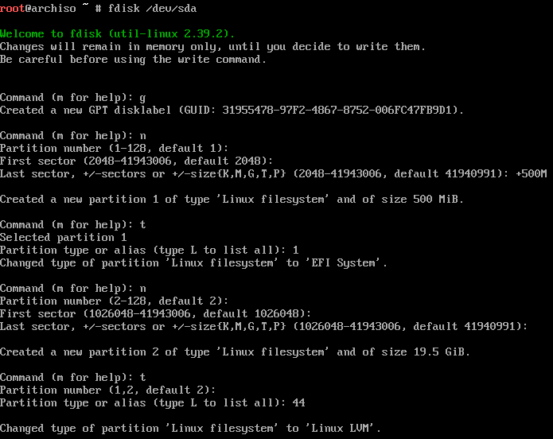
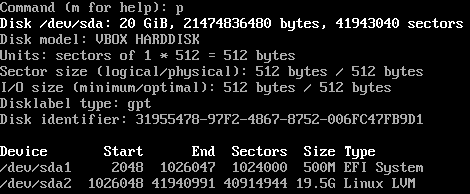
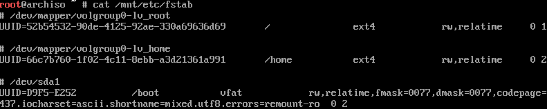
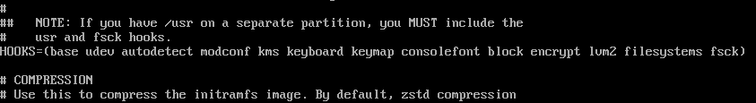

_NOTICE: Always cross-reference the [Arch Linux Wiki](https://wiki.archlinux.org/) for the most up-to-date information._

## Installing Arch

Installing Arch is a rather daunting task for most beginners, considering it's a rather large step up from what you might have already used, like Ubuntu. This guide hopes to help simplify the sheer amount of information provided by the Arch Wiki into a more directed guide in a way that I like to configure my system. If you do want to follow along, I'd strongly recommend booting up a VM in your preferred software and make snapshots along the way. I won't cover everything in detail & you'll most likely have to troubleshoot as things diverge, so make sure you also have the [Arch wiki installation guide](https://wiki.archlinux.org/title/Installation_guide) in another tab for easy reference.

## Objectives & Requirements

Once you've finished with this guide, you'll have achieved a system that has:

- LVM with encryption
- 2 LVM volumes, one for `/home`, and the other for `/`
- Systemd-boot as the bootloader
- A swapfile
- KDE plasma as the desktop environment
- Secure boot enabled

Note that if you want to do this, you'll need to have a computer that supports 64-bit UEFI and have secure boot disabled, as well as have the drive to figure stuff out when things (inevitably) go wrong.

## Pre-installation

Before we install anything to the disk, we need to prepare our installation media & our computer.

### Acquire the installation image

Head to the Arch Wiki [download's](https://archlinux.org/download/) page & grab the ISO. This will need to be flashed to a USB. [Rufus](https://rufus.ie) is a good pick or [Ventoy](https://www.ventoy.net) if you like having a dedicated USB with many types of ISOs. You might need change the boot order in the UEFI to load the Arch install from the USB.

### Connecting the internet

Ah, the bane of Arch laptop users everywhere. Now if your using Ethernet or a VM, you should have internet already (`ping -c 5 archlinux.org` to verify) and can move onto the next step; if your using Wi-Fi, let's get you up and running.
We'll be using [iwctl](https://wiki.archlinux.org/title/Iwd#iwctl) to help us connect.

First, we'll need to make sure its daemon is running, then start the interactive prompt:

```
# systemctl start iwd
# iwctl
```

From here, we'll need to see what adaptors are available:

```
[iwd]# device list
```

Pick an adaptor (like `wlan0` for example if it's there), then run the following commands:

```
[iwd]# station <device> scan
[iwd]# station <device> get-networks
```

This will print out a list of available Wi-Fi networks. Once you connect to your Wi-Fi network, you'll be prompted to supply a password if needed.

```
[iwd]# station <device> connect <SSID>
```

Once you're connected, exit out of the prompt and verify you have internet access:

```
[iwd]# exit
# ping -c 5 archlinux.org
```

If everything is working, we can move on.

### Partitioning the disk

I hope you backed up your data on your drive, cause this step is gonna cause **data loss**.
First, you'll need to see what device your storage drive is with [fdisk](https://wiki.archlinux.org/title/Fdisk):

```
# fdisk -l
```

You should see your disk assigned as `/dev/sda` or `/dev/nvme0n1`. In my case, it's `/dev/sda`, which I'll be continuing to use for this tutorial.


We'll then want to go into the interactive prompt.

```
# fdisk /dev/sda
```

For this step, we'll be creating 2 partitions, a boot partition `/boot`, and the root partition `/`.
You'll first want to wipe the drive blank with `g`, then `n` for a new partition. Select the default for both the partition number and the first sector but set the last sector to `+500M`. We'll then need to change the partition type to a EFI partition, which we'll do with `t` with the type being `1`.
We then repeat the steps for the root partition; `n`, select all defaults, followed by `t` with type `44` (note that the type can change as `fdisk` is updated, type `L` to list all of the types, and find the number with `Linux LVM`).



Once you've done that, type `p` to get the proposed partition layout and see if it looks the same as mine.



Once you're happy, type `w` to confirm the changes to disk, which you'll now be able to see in `fdisk -l`. We'll now need to format the `/boot` partition with FAT32, which is done with:

```
# mkfs.fat -F32 /dev/sda1
```

### LVM with Encryption

So what is LVM? LVM stands for Logical Volume Manager, which allows our files to be stores in a volume instead of directly on the partition. This allows for easy dynamic resizing of volumes, something which is quite difficult to do with partitions. Regardless if you end up using it or not, its always good to have just in case, as there is no downside for having it. These volumes will reside inside our partition which will be encrypted with LUKS, with more info found on the [wiki](https://wiki.archlinux.org/title/Dm-crypt/Encrypting_an_entire_system#LVM_on_LUKS).

#### Encrypting the partition

First, we'll need to encrypt the partition. Make sure you set a strong password (or even better, a passphrase) and make sure you don't forget it!

```
# cryptsetup luksFormat /dev/sda2
```

We'll then need to access the encrypted partition:

```
# cryptsetup open /dev/sda2 cryptlvm
```

Now as you've opened the encrypted partition, it created a decrypted reference in RAM, which you can find at `/dev/mapper/cryptlvm`.

#### Setting up LVM

Now for LVM. First, we'll need to create a physical volume:

```
# pvcreate /dev/mapper/cryptlvm
```

Followed by a volume group (you can name the volume group to be anything, this guide will use `volgroup0`):

```
# vgcreate volgroup0 /dev/mapper/cryptlvm
```

We'll now create 2 logical volumes, one for root `/`, and the other for the home folder `/home`. For our root folder, 32GB will be more than enough, and the home folder will take up the rest of the space.

```
# lvcreate -L 32G volgroup0 -n lv_root
# lvcreate -l 100%FREE volgroup0 -n lv_home
```

Now as we'll be formatting these volumes with ext4, we'll leave 256MB free in `volgroup0` to allow for automated error checking and trimming.

```
# lvreduce -L -256M volgroup0/lv_home
```

Now we'll format the volumes with ext4:

```
# mkfs.ext4 /dev/volgroup0/lv_root
# mkfs.ext4 /dev/volgroup0/lv_home
```

And mount the file systems:

```
# mount /dev/volgroup0/lv_root /mnt
# mount --mkdir /dev/volgroup0/lv_home /mnt/home
# mount --mkdir /dev/sda1 /mnt/boot
```

Finally, we'll create a `fstab` file to allow our operating system to know what devices it needs to mount at boot. Once you generate the fstab file, print it out with `cat` and see if everything looks good.

```
# genfstab -U /mnt >> /mnt/etc/fstab
# cat /mnt/etc/fstab
```

<!-- // cSpell:disable -->

Your `fstab` file should look similar to mine, ignoring the UUIDs (note that the last line is wrapped). For the last line, you'll need to change last line to contain `fmask=0077,dmask=0077`.

<!-- // cSpell:enable -->

If the rest of the file doesn't match the image below, read through the above again to make sure you haven't missed a step, and refer to the [Arch Wiki](https://wiki.archlinux.org/) to make sure that the information here isn't outdated.


## Installation & Configuration

Now we've set up everything, now we can actually start to install Arch Linux onto your storage disk, how exciting!

### Installation

We'll need to install the base package, as well as Linux itself of course! Now as for packages, I'd recommend installing both `linux` and `linux-lts` plus their headers, just in case something breaks in the kernel and you need to head to a known LTS version. However I've personally never needed to use the `linux-lts`. If you're following along in a VM, you can omit installing `linux-firmware`.

```
# pacstrap -K /mnt base linux linux-headers linux-lts linux-lts-headers linux-firmware
```

We'll now chroot into our working installation to continue downloading more packages:

```
# arch-chroot /mnt
```

#### Packages

There are some additional packages we'll need to install:

```
# pacman -S lvm2 networkmanager
```

This will provide LVM support, network managing to connect to the internet.

Now the base package doesn't contain all of the tools we might like to use in our installation.

Here's a list of packages you might wanna consider installing:

- `nano` or `vim` : CLI text editors. If you're not familiar with `vim`, go with `nano`.
- `base-devel` : A collection of development packages.
- `iwd` `wpa_supplicant` : If you want Wi-Fi support you'll need these. Recommended even if you're not going to use Wi-Fi in case you need them down the road.
- `man-db man-pages` : Used for reading man pages.
- `amd-ucode` or `intel-ucode` : Download the package matching your CPU. These provided patches to your CPU.

### Configuration

Time to configure!

#### Time zones

<!-- // cSpell:disable -->

We'll also want to configure the appropriate time zone for your location. You can view your region and city in `/usr/share/zoneinfo/`. For example, if you lived in Sydney Australia, you'd write the following command:

```
# ln -sf /usr/share/zoneinfo/Australia/Sydney /etc/localtime
```

Then configure the hardware clock:

```
# hwclock --systohc
```

<!--// cSpell:enable -->

#### Localization

Edit the `locale.gen` file and uncomment the appropriate UTF-8 locals. In my case it would be `en_US.UTF-8 UTF-8`. Once you've picked your locale files, generate them:

```
# nano /etc/locale.gen
# locale-gen
```

Then create a `locale.conf` file with the LANG variable.

```
echo "LANG=en_AU.UTF-8" | tee /etc/locale.conf
```

#### Network config

Let's make sure networking will be up and running once we finish our install:

```
# systemctl enable NetworkManager.service
# systemctl enable systemd-resolved.service
# systemctl enable wpa_supplicant.service
```

We also need to setup the DHCP client, which we'll do with `iwd`. Create a new file at `/etc/iwd/main.conf`, and add the following to the file:

```
[General]
EnableNetworkConfiguration=true
```

And finally, we need to set our hostname. Imma pick `GravyArch`:

```
echo "GravyArch" | tee /etc/hostname
```

#### Initramfs

As we have both LVM & encryption, we'll need to modify the initramfs. When editing `/etc/mkinitcpio.conf`, find the first uncommented like that says `HOOKS`. From there, you'll want to add the works `encrypt lvm2` in between `block` & `filesystems`. Note that the order is important.



Then we need to regenerate all of the initramfs images:

```
# mkinitcpio -P
```

#### Passwords & Users

We'll want to set a root password (we'll disable root login after our installation later for security).

```
passwd
```

It's generally unwise to do everything in root once our system is installed, so let's add a user. I'll use the username `gravy` and add the user to the group `wheel`.

```
# useradd -mg users -G wheel gravy
```

Then give the user a password.

```
passwd gravy
```

Then to give our user root privileges via `sudo`, we'll need to configure `sudo` and uncomment the line `%wheel ALL=(ALL) ALL`:

```
EDITOR=nano visudo
```

And now our user will have sudo privileges!

### The Bootloader

Our system is now finally configured, but it won't boot without a bootloader! We'll be using systemd-boot as mentioned before, which has already been pre-installed onto our install. To install systemd-boot, we run the following command:

```
# bootctl install
```

But we're not done yet. We still need to configure our boot partition. Copy the follow text into `/boot/loader/loader.conf` (make sure you only use spaces, tabs won't work!):

```
default      arch.conf
timeout      5
console-mode keep
editor       no
```

This is the config file for systemd-boot. Now we need to define the boot entries. First, we want to set a label for our encrypted partition, let's call it `arch_os`:

```
cryptsetup config --label="arch_os" /dev/sda2
```

Now copy the following text into `/boot/loader/entries/arch.conf` (assuming you installed the `amd-ucode` and `linux` package):

```
title   Arch Linux
linux   /vmlinuz-linux
initrd  /amd-ucode.img
initrd  /initramfs-linux.img
options cryptdevice=LABEL=arch_os:volgroup0:allow-discards root=/dev/volgroup0/lv_root rw
```

And do the same for the fallback initramfs:

```
title   Arch Linux (Fallback)
linux   /vmlinuz-linux
initrd  /intel-ucode.img
initrd  /initramfs-linux-fallback.img
options cryptdevice=LABEL=arch_os:volgroup0:allow-discards root=/dev/volgroup0/lv_root rw
```

If you installed another version of linux (like `linux-lts`), repeat for each new linux version.

### Reboot

Exit the chroot with `exit`, and type:

```
umount -R /mnt
```

This will unmount the partitions. Remove the installation media & type `reboot`. If all goes well, you should boot into Arch Linux!

## Post-Installation

If you've booted up into your Arch install, unlock your disk encryption & login using `root`.

### Desktop Environment

Now I'm not sure about you, but interacting with the raw CLI gets old rather quickly. Let's get a Desktop Environment set up! Now I'd recommend having a look at the [many options to choose from](https://wiki.archlinux.org/title/Desktop_environment), including window managers, though I'll be picking KDE-Plasma. I'll also be installing its full set of applications along with it as well as the Xorg display server.

```
# pacman -S plasma-meta kde-applications xorg-server
```

We'll also need to install the graphics drivers. If you use intel or amd graphics, use the `mesa` package. If you have use Nvidia, you'll need to install `nvidia` and/or `nvidia-lts` depending on what linux version you installed.
If your using a VM, install `virtualbox-guest-utils` and enable `vboxservice.service`.
We also need to enable our display manager (the lock screen):

```
# systemctl enable sddm
```

Once that is all done, reboot.

### Disabling root login

You'll want to login as a non-root privileged user for this one. Simply type the following commands to disable root login:

```
$ sudo passwd -l root
```

if you want to become root, simply type:

```
$ sudo -s
```

### Generating a swapfile

A swapfile is where the operating system can place some the unused RAM contents if the RAM ever becomes full. First, we need to generate a file to become a swapfile, let's say 2GB:

```
# dd if=/dev/zero of=/swapfile bs=1M count=2k status=progress
```

We'll then need to set it to read and write by root only.

```
# chmod 600 /swapfile
```

Then we need to format the file to be a swapfile:

```
# mkswap -U clear /swapfile
```

We now need the system to mount the swapfile as swap in out fstab configuration. First make a backup, then write the following command:

```
# cp /etc/fstab /etc/fstab.bak
# echo "/swapfile none swap defaults 0 0" | tee -a /etc/fstab
```

Check your fstab configuration to make sure that the swapfile entry isn't the only entry. Your swapfile will then be used once you restart your computer, or if you want to activate it now:

```
# swapon /swapfile
```

### Secure Boot (Advanced)

We'll be using `sbctl` to manage and setup secure boot. Just be advised that it does not work with all hardware. [More details can be found here](https://wiki.archlinux.org/title/Unified_Extensible_Firmware_Interface/Secure_Boot#Using_a_signed_boot_loader).

You'll need to install the following packages:

- `efibootmgr` : Configuration of boot order, and anything else with the UEFI
- `sbctl` : Configuration and manage Secure Boot
- `shim-signed` : A pre-signed bootloader (needs to be installed from the AUR)

#### Enable Setup Mode

You'll first need the enter the UEFI and change Secure Boot to "Setup Mode". As each manufacturer has as a different layout, you'll have to figure this out on your own, but it will most likely be under "Security" banner. You might also need leave secure boot disabled.

#### Setting up shim

Once you've installed `shim-signed` from the AUR, run the following command to rename your current bootloader:

```
# mv /boot/EFI/BOOT/BOOTx64.EFI /boot/EFI/BOOT/grubx64.efi
```

You'll then want to copy the shim files over, renaming them in the process:

```
# cp /usr/share/shim-signed/shimx64.efi /boot/EFI/BOOT/BOOTx64.EFI
# cp /usr/share/shim-signed/mmx64.efi /boot/EFI/BOOT/
```

Then add a new entry into the boot order using `efibootmgr`:

```
# efibootmgr --unicode --disk /dev/sda --part 1 --create --label "Shim" --loader /EFI/BOOT/BOOTx64.EFI
```

What this does is that when shim is executed, it will try and launch a file called `grubx64.efi`, and verify its hash with `mmx64.efi` ([more details here](https://wiki.archlinux.org/title/Unified_Extensible_Firmware_Interface/Secure_Boot#shim)).

#### Using sbctl

Now we'll use `sbctl` to assist us. [More info can be found here](https://wiki.archlinux.org/title/Unified_Extensible_Firmware_Interface/Secure_Boot#Assisted_process_with_sbctl). First check to see if secure boot is in setup mode:

```
$ sbctl status
```

You should see that `sbctl` is not installed and secure boot is disabled.
We'll then want to create new keys, and enroll them with Microsoft's keys:

```
# sbctl create-keys
# sbctl enroll-keys -m
```

Then re-check the status:

```
$ sbctl status
```

`sbctl` should now be installed, but now we'll need to sign our files. Let's verify what files need to be signed:

```
# sbctl verify
```

Sign all files listed but note that you may need to manually sign additional files, usually the kernel & bootloader files.

```
# sbctl sign -s /boot/vmlinuz-linux
# sbctl sign -s /boot/EFI/BOOT/BOOTX64.EFI
```

As we are using systemd-boot, we also need to sign an additional file to ensure that all of the files are signed when the bootloader is updated:

```
# sbctl sign -s -o /usr/lib/systemd/boot/efi/systemd-bootx64.efi.signed /usr/lib/systemd/boot/efi/systemd-bootx64.efi
```

Once everything is signed, reboot your system and enable secure boot in the UEFI. If everything loads, secure boot should be working, which you can verify with:

```
$ sbctl status
```

## Wrapping up

Hopefully this guide has assisted you in running Arch Linux for the first time, although this set up is a bit more complicated than it needs to be. I'd also highly recommend exploring other packages, desktop environment's, etc. to make your system yours. I'd also recommend looking at the [Arch Wiki's General Recommendations](https://wiki.archlinux.org/title/General_recommendations) for anything I didn't cover. Best of luck!
