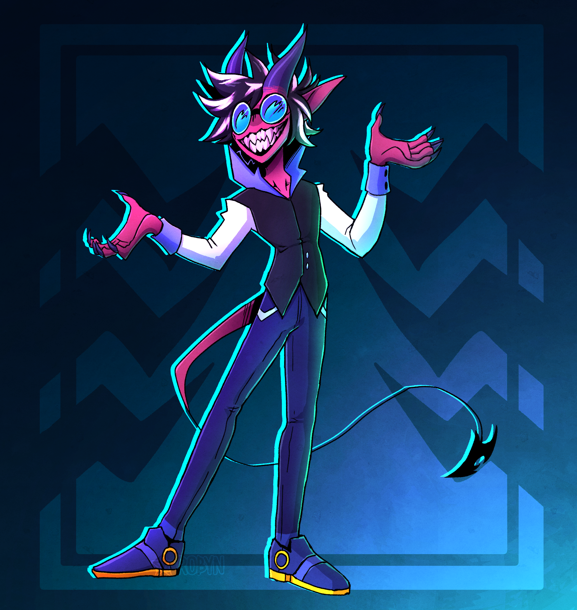

import { Image } from "astro:assets";

## Preamble

### Prior experiences

About 2 years ago, I wanted to make a personal website to use my apex domain `gravydigger.net`. Now at this point my only experiences with making a website was with raw HTML & CSS from high school and a basic web app using Next.js in one of my university courses.

This resulted in me hating front end work due to having to work with raw HTML & CSS, so I wanted to use a framework this time. Now I'd probably should have used a framework like React, but I mainly wanted something that I thought was simple & easy to learn. I also wanted to make this new website a static one-paged website. After exploring my options, I found a framework called [Astro](https://astro.build/), which was in version 2.0 at the time. I liked the modularity of components, and made my very first website publicly available, hosted on GitHub. You can find the [repo here](https://github.com/Gravydigger/One-Paged-Website) for prosperity's sake, as well as what the website looked like on the [WayBack Machine](https://web.archive.org/web/20231214162654/https://gravydigger.net/).

Now while I was very happy with the result of my website, there were a few issues with it that were caused due to my inexperience. The main one was that the website had a poor mobile viewing experience. Another issue was the dependence on JavaScript. I'm a bit of a privacy nut, so I automatically have my browser disable rendering of any JavaScript on my browser. Sadly, to change to different sections of the website for viewing, you needed JavaScript enabled. While this isn't a big deal for the average person, I'd rather have a website be completely usable without it.

### So why make a blog?

[One of my friends](https://cubie87.github.io/) recently decided to make a blog to document their findings and to also keep a public record of what they have done, both for themselves and for others. I like the idea of a publicly accessible archive of my thoughts, especially as I tend to have to refer to other websites and documentation to remind myself how to do certain things, like my post on [installing Arch Linux](/posts/arch-install). While it is true that anything on the internet stays there forever, time can make it really difficult to track down sources and information if they've been taken down, or if you can't remember where a vital piece of information is that you remember viewing but can't quite remember what it was.

## The actual blog making

Now with the preamble out of the way, let's get to the meat of this post.

### Picking a template

Now I knew I was gonna make my website in Astro as that was what I was most familiar with, but my lack of experience with web dev made me want to piggyback on the work of someone else that knows what they are doing instead to make an actually decent website. I also wanted to try out [Tailwind](https://tailwindcss.com/) since I've heard it makes CSS easier to use and manage.

After having a look at the options, these where my top 3 choices:

- [AstroPaper](https://github.com/satnaing/astro-paper)
- [Astro Cactus](https://github.com/chrismwilliams/astro-theme-cactus)
- [Nimbus Narratives](https://github.com/abdllahdev/nimbus-narratives)

Ultimately, I decided to go with Astro Cactus, as it had a very minimalistic appearance but had quite a few nice features without being overly complex.

### Breaking into the repo

With the template installed in my own GitHub repo, it was time to make some changes to make the website mine.

#### Configuration

The template's README contained some valuable information on areas I needed to modify first. Some notable first changes were:

- Changed out the logo ([see next section](#making-a-logo))
- Added the class `dark` to the html tag to make the page default to dark mode, even if JavaScript was disabled.
- Edited social media links to point to my own.

I also started modifying other pages (about, 404, etc.) and deleting the template posts, but those changes aren't particularly interesting to read about.

#### Making a logo

Now my previous website had a SVG logo of a husky, which you can view here has a png.

However, I felt that this colour scheme wasn't something that fit this website, and I wanted something more abstract, but still wanted something that related to me in some way. So after looking at my collection of artworks I've commissioned over the years, I decided to settle on the tattoo design of one of my characters, Grefi[^1]. I liked the zig-zag nature of the design, so I decided to make a logo of it in [Inkscape](https://inkscape.org/).


[^1]: This particular image is drawn by the artist [RobynTheDragon](https://robynthedragon.carrd.co/)

Now I'm pretty happy with the final result, but whenever I look at it, it always seems that the spikes were off-centre, despite checking several times that the logo was symmetrical. Maybe it's an optical illusion? I definitely can't say.


#### Open Graph & Satori

Have you noticed that when you share a link on social media it usually embeds the link, giving some more information on what the page is about? This is done via the [Open Graph Protocol](https://ogp.me/), which simply has you add `<meta>` tags to your web page. [Satori](https://github.com/vercel/satori) allows you to convert HTML & CSS into an SVG, allowing for dynamically created embed images for each of my posts. Pretty cool right?

<Image
	src="/og-image/create-blog.png"
	alt="The Open Graph embed for this very blog!"
	width="750"
	height="150"
/>
What wasn't cool was the hours taken trying to figure out why my logo wasn't working with the image
generation, despite working within the website itself. Turns out the SVG output of the images
provided by Inkscape and the input of Satori _isn't_ compatible. Let's take an example for one of
the paths in the Inkscape logo SVG (note that the `d` attribute has been omitted for clarity):

```xml
<path style="display:inline;fill:#2d2537;stroke-width:1.22169;stroke-miterlimit:1" d="..." /><path>
```

As you can see, Inkscape defines the styling in a `style` attribute, with the values being like what you could see in CSS. So what would Satori accept? After an hour or so of experimenting:

```xml
<path fill="#2d2537" d="..."></path>
```

It turns out that each style needs to be its own attribute! Hours of my life down the drain...
After removing unnecessary styles and fixing the attributes, the results look pretty good. Try posting the link into Discord or another social media that support link embeds and you'll see what I mean.

## Custom modifications

At this point, I've gotten a website up looking nice, and I've just finished my [first blog post](/posts/arch-install/). But there are a few things missing...

### RSS

The social media icons in the home page come from [Icônes](https://icones.js.org/), giving us quick access to a large number of icons at our disposal. Let's copy the HTML from the social media component:

```astro
<a
	class="inline-block p-1 sm:hover:text-link"
	href={link}
	target="_blank"
	rel={`noopener noreferrer ${isWebmention ? "me authn" : ""}`}
>
	<Icon class="h-6 w-6" name={name} aria-hidden="true" focusable="false" />
	<span class="sr-only">{friendlyName}</span></a
>
```

Now let's make it suitable for our RSS icon. As this is an internal link, we can remove the `rel` attribute. We'll also want to:

- set the anchor to link to the RSS feed,
- set the icon to show the standard RSS icon, and
- change the `span` content to inform screen readers.

With those modifications, we get this:

```astro
<a class="inline-block p-1 sm:hover:text-link" href="/rss.xml" target="_blank">
	<Icon class="h-6 w-6" name="mdi:rss" aria-hidden="true" focusable="false" />
	<span class="sr-only">RSS</span>
</a>
```

And now we have our RSS icon & link! We'll put it next to the "Posts" heading in both the home page and posts page. However, to make the icon appear next to the right of the heading, we'll encapsulate both in a `span` with the `flex` class & change the size of the icon to be the same size as the heading. And boom, done:

```astro
<span class="flex">
	<h2 class="title mb-4 text-xl">Posts</h2>
	<a class="inline-block p-1 sm:hover:text-link" href="/rss.xml" target="_blank">
		<Icon class="h-5 w-5" name="mdi:rss" aria-hidden="true" focusable="false" />
		<span class="sr-only">RSS</span>
	</a>
</span>
```

## LaTeX rendering for maths

That [same friend I mentioned earlier](#so-why-make-a-blog) also introduced me to $$\LaTeX$$, so I think he'd like this section.
After noticing that there wasn't any support for rendering maths, I looked into Astro's documentation regarding [markdown configuration](https://docs.astro.build/en/guides/markdown-content/#configuring-markdown-and-mdx). It mentioned support for `remark` & `rehype`, which I like to think of as tokenizing & parsing respectively. Having a look at recommended plugins, I stumbled upon a monorepo called [`remark-math`](https://github.com/remarkjs/remark-math), which contained plugins for remarking & rehyping mathematical equations.

### Remarking

Remarking only had one option, `remark-math`, which was a node module that had to be installed and defined in `astro.config.ts`. I've also set an option to prevent single dollar signs from being interpreted as wrappers for $$\LaTeX$$ code, as that can cause rendering issues.

```ts
export default defineConfig({
	markdown: {
		remarkPlugins: [
			...
			[remarkMath, { singleDollarTextMath: false }],
		],
		...
	},
	...
});
```

### Rehyping

Rehyping had two options, `rehype-katex` & `rehype-mathjax`. Now my first attempt was with MathJax, as that was what I was familiar with. However, the styling of the maths left much to be desired, and you couldn't copy the equations, which lead to me looking at KaTeX. Again, this was installed as a node module and defined in `astro.config.ts`:

```ts
export default defineConfig({
	markdown: {
		...
		rehypePlugins: [
			rehypeKatex,
		],
		...
	},
	...
});
```

While I didn't need to define any options within the config, KaTeX required a stylesheet to properly render. This wasn't great, as the documentation kept referring to an external stylesheet elsewhere. However, looking inside the module revealed an identical CSS file within. To refer to the stylesheet, a modification was made to the `tsconfig.json` file to specify a path to the stylesheet, which was then imported to the Blog's layout page, allowing $$\LaTeX$$ to be used in all of my blogs from now on!
