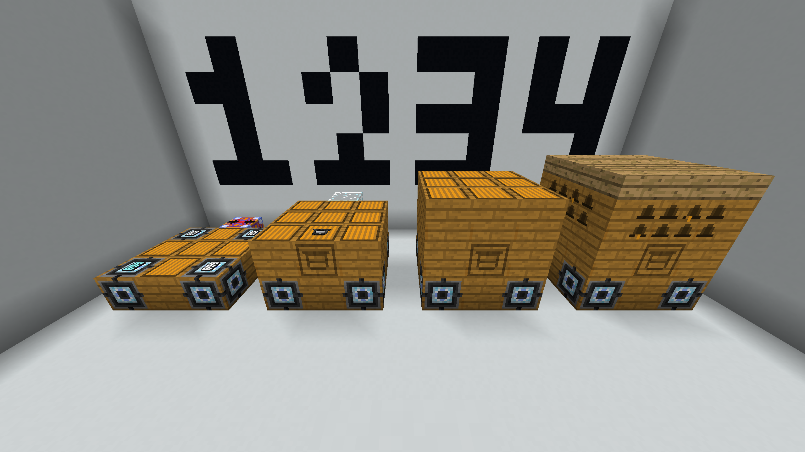
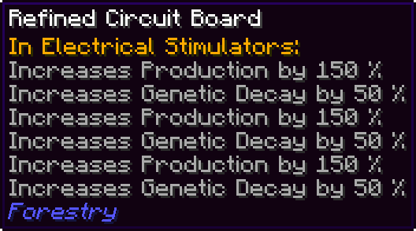
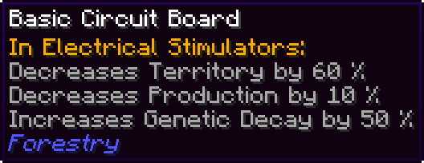

Ever heard of the Minecraft modpack FTB Revelations? Personally, it's one of my favourite modpacks in which I've spent at least several hundred hours on. During that time, I experimented and found a way to get a ludicrous amount of $$RF/t$$. Now, I decided to delve deep into the source code of the mods that make it possible to show you how it all works, as well as showing you how to build this contraption, all derived from a single queen bee from the career bees mod.

## Why Should I Bother?

Now putting aside the massive power generation, what do you have to do to achieve it, and what else do you have to do to maintain it?
This energy production method is rather late game. You need to be deep into bee breeding and genetic engineering to get the right traits and resources.
As for the energy generation itself, it's very low maintenance. No fancy frame swapping, no pipes, nothing like that; once you've built it, it will produce away practically forever.

## Getting 2 Billion RF/t

Ok, so your convinced about building this. Lets get ready to build this thing!

### Perquisites

To start doing this you're gonna need to establish a bee breeding setup, ideally with Gendustry.

To start with, you'll need to get an Imperial Bee and start being able to make an Alveary.
From there, you'd going to want to aim for an Energy bee with the following traits. Note that any trait that's in bold is mandatory, and any trait in italics is optional but strongly recommended:

- **Species: Energy** - Sourced by the Energy Bee.
- Lifespan: Longer - Don't worry too much about this, it gets improved by a Frame.
- **Speed: Robotic** - Obtained by the Robotic Bee.
- Pollination: Anything.
- Flowers: Stone - Get from the Rocky Bee.
- Fertility: Ideally 1 to prevent drones from building up.
- Area: Any.
- **Effect: RF Inducing** - Sourced by the Energy Bee.
- Temperature: Anything that fits your base's location.
- Temperature Tolerance: Anything that fits your base's location.
- Humidity: Anything that fits your base's location.
- Humidity Tolerance: Anything that fits your base's location.
- _Nocturnal: Yes_ - Get from the Rocky Bee.
- _Flyer: Yes_ - Get from the Rocky Bee.
- _Cave: Yes_ - Get from the Rocky Bee.
  Getting all of the traits will take you a while, so you should also be establishing a Draconic Energy core, as it will be the only thing that will accept the shear amount of energy being produced from our bee (Flux Plugs sadly don't work.)

At the end of this, you'll also want to produce the Eternal Frame, which will allow our bee to live practically forever.

### Building

You'll need the following materials to build an Alveary:

- 22x Alveary Blocks
- 9x Wooden Slabs
- 4x Electrical Stimulators
- 3x Refined Circuit Boards
- 1x Alveary Frame Holder
- 1x Eternal Frame
- 1x Basic Circuit Board
- 1x Energy Pylon
- 1x Glass

And build them like such:

The Eternal Frame should go into the Alveary Frame Holder, while the Circuit boards go into the Electrical Stimulators. As for the boards themselves, each Refined Circuit Board should contain 3 Diamantine Electron Tubes (putting 4 in would be a waste[^1]). As for the Basic Circuit Board, place in a Tin Electron Tube. This is to prevent us hitting the game's [integer limit](#what-integer-limit).

Then finally place in the Energy Princess & Drone, both should look like so something like this:

Make sure that you check the energy Stimulators to see if they have power. If they don't, invert the direction of the energy pylon by right clicking on the glass twice, and you should be getting over 2 billion RF per tick!

## The Math

Ok that's cool and all, but how does this work, and why can't we go any higher? Well, the $$RF/t$$ the energy bee produces can be shown in the following equation:

$$
RF/t = \left\lceil400 * \left(s*\left(d*\prod_{i=1}^n\left(mb\right)\right)\right)^2 \right\rceil
$$

Where:

- $$RF/t$$ is Redstone Flux per tick,
- $$s$$ is the speed of the bee,
- $$d$$ is the mode / difficulty multiplier (usually set to normal, which is $$1$$),
- $$b$$ is the building's multiplier, which for an alveary is $$1$$,
- $$m$$ is the modifier for each building modifier, and
- $$RF/t$$ not exceeding a value of $$2^{31}-1$$.

…ok let's be real here, unless you're mathematically inclined, this has probably spooked you more than anything. Let's break this down step by step.

### RF Production

The source code[^2] specifies that the RF rate is:

$$
RF/t = \left\lceil400 * \left(speed\right)^2 \right\rceil
$$

With the $$\lceil x\rceil$$ meaning to round up to the nearest whole number. This energy is then deposited into every adjacent block that can accept power until:

1. Either all of the power has been consumed for that tick, or
2. All energy accepting blocks cannot accept any more power.

This shows that to get as much power as possible, the bee needs to be as fast as possible.

### Maximising Speed

Looking at the source code[^3][^4], the speed is defined as:

$$
s*\left(d*\prod_{i=1}^n\left(mb\right)\right)
$$

Now as we'll be using an Alveary & not changing the difficulty of Forestry, we can remove some variables as they are equal to $$1$$. We can also set $$s = 2.5$$ due to the bee having its speed trait being set to `robotic`, which means they work at 250% speed.

$$
2.5*\prod_{i=1}^n\left(m\right)
$$

Now what about that weird symbol $$\prod$$ and the $$m$$? This simply means that each modifier is multiplied together to get a final value. Speaking of modifiers...

### Applying Modifiers

The Electrical Stimulator[^1] allows us to use circuits to apply buffs to our bees, in exchange of power consumption. Each Refined Circuit Board applies a 10x multiplier to the bee's speed, allowing for insane $$RF/t$$. However, to avoid going over the integer limit, the Basic Circuit Board is used to reduce production by $$0.9$$, allowing us to just reach below the limit. This results in the bee's speed being multiplied by:

$$
2.5 * 10 * 10 * 10 * 0.9 = 2250
$$

### What Integer Limit?

I've mention that the maximum possible $$RF/t$$ is $$2^{31}-1$$, but why is there a limit?

The $$RF/t$$ is defined as an integer, which can store values up to $$2^{32} -1$$ . But for an integer to support both negative and positive numbers, the most significant bit is used to indicate to the computer if this number is positive or negative, reducing limit the to $$2^{31} -1$$, which when expanded is equal to:

$$
2^{31}-1 = 2,147,483,647
$$

Anything larger than this number, it overflows, resulting in the number wrapping back to negative and counting up from there. Therefore, we want to try and get as close as we can to that limit without going over.

[^1]: [Binnie's Wiki article on the Electrical Stimultor](https://binnie.mods.wiki/wiki/Electrical_Stimulator)
[^2]: [Source code showing the RF rate of the energy bee](https://github.com/rwtema/Careerbees/blob/master/src/main/java/com/rwtema/careerbees/effects/EffectPower.java#L63)
[^3]: [Source code showing how bee speed is calculated](https://github.com/rwtema/Careerbees/blob/master/src/main/java/com/rwtema/careerbees/effects/EffectBase.java#L78)
[^4]: [Source code showing how the modifiers are calculated](https://github.com/ForestryMC/ForestryMC/blob/mc-1.12/src/main/java/forestry/apiculture/BeeHousingModifier.java#L54)

## Thanks for Reading!

I've been wanting to write up about this when I first discovered it in 2021, but procrastination stopped me in my tracks. As the years went on, I always tried to find where I found these equations and figure out my own working out process but kept giving up. Finally, I decided to sit down and actually look into the code for each of these mods to figure out how they work to produce the maximum RF possible. It's been a long time coming, and I'm glad I've finally been able to write about it!

If you have anything else you'd like me to write about, feel free to let me know!
