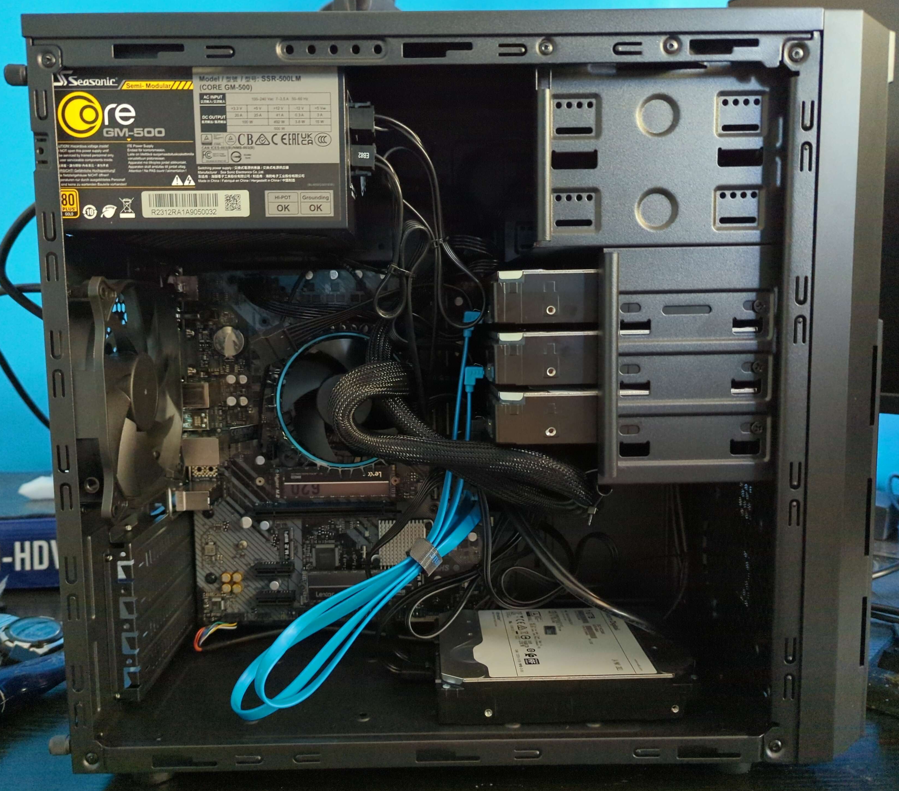

For a long time, I've wanted to have a HomeLab in my house, however being a university student at the time, it was hard to justify the cost of buying something relatively powerful, especially if I wanted a large amount of storage in the form of a NAS. As you could imagine, once I started working full time, this was one of the first things I'd bought with my first paycheck.

## Requirements

As I had a lot of time to think about what I wanted, I took that time to decide what my requirements were. Now compared to a workstation; server requirements are not as significant due to the type of workloads they normally preform. In the end, I decided these were the type of things I wanted my server to be able to do:

- Support creating virtual machines.
- Being a NAS to host files with NFS or Samba.
- Being able to watch video using [Jellyfin](https://jellyfin.org/) real-time transcoding.
- Being able to be a [Seedbox](https://en.wikipedia.org/wiki/Seedbox).

Having a look at these requirements, I look some time to determine what software / hardware was needed to fulfil them.

### Virtualization

During my research, I found 3 possible contenders:

- [TrueNAS Scale](https://www.truenas.com/truenas-scale/)
- [Unraid](https://unraid.net/)
- [Proxmox Virtual Environment (VE)](https://www.proxmox.com/en/proxmox-virtual-environment/overview)

TrueNAS Scale was dismissed rather early in my research, as while as it is nice having an NAS application with container support; I found that I wanted to be able to have lower-level control with my applications, and to have proper VM support.

Unraid seemed to be a lot more user friendly compared to Proxmox, being a "powerful, easy-to-use operating system for self-hosted servers and network-attached storage". Unraid allows for any size of disks to be used for storage, has in-built file sharing, and virtualization with both containers & VMs. However, it is a paid product which limits the number of disks that can be attached with the cheaper licenses & required the OS to be booted off of a USB drive whenever the server is powered on. (EDIT: During time of writing, it seems that the payment model has changed, with anything outside of its lifetime license requiring you to pay an additional cost to access OS upgrades for every year.)

Proxmox VE is an "open-source server management platform for enterprise virtualization", which creates and manages virtual machines. It is completely free to use, though there is a subscription to allow access to the "Proxmox Enterprise Repository". It doesn't support containers in the same sense of something like Docker, but more so a lightweight VM that shares the host systems kernel.

In the end, I decided to pick Proxmox VE due to being able to install onto an SSD, the free price tag, and the fact I have experience with Linux environments (so something like native docker container support isn't really that big of an issue). It also allows for Proxmox to be raided on multiple disks to allow for redundancy.

### File-sharing & Management

Once I decided to go with Proxmox, I thought that I would have to manually manage ZFS partitions as well as the NFS server via a dedicated VM. Not a big issue, but definitely something I'd rather not have to manage directly.
However, it turns out that TrueNAS Scale can be run in a VM with storage being directly passed to the VM via a passthrough. Whilst there seemed to be concern with stability regarding having TrueNAS Scale being run as a VM in the past, it seems that the current consensus considers that Proxmox's virtualization passthrough has reached a point of maturity doing so is rather stable.

### Seeding & Transcoding

Luckily, seedboxes don't really need a lot of resources outside of a stable internet connection & a bunch of storage, which are fortunately covered by the other requirements.

Instead of investing in a dedicated GPU for transcoding, I decided to invest in a beefier CPU with an iGPU for hardware transcoding. As Intel has the best support for this due to improved Quick Sync Video, I originally was going to invest in an 12th gen Intel CPU. However, I found the price jump to 14th Gen wasn't too bad, so decided to buy an 14th Gen Intel CPU instead.

## The Specs

So after I nailed down my requirements, this is what I ended up getting:

| Type             | Item                                                                      | Price (AUD)   |
| :--------------- | :------------------------------------------------------------------------ | :------------ |
| **CPU**          | Intel Core i5-14500 2.6 GHz 14-Core Processor                             | $398.77       |
| **Motherboard**  | ASRock B660M-HDV Micro ATX LGA1700 Motherboard                            | $129.00       |
| **Memory**       | Silicon Power SP032GBLFU320X22 32 GB (2 x 16 GB) DDR4-3200 CL22 Memory    | $97.00        |
| **Case**         | Antec VSK 3000 Elite MicroATX Mini Tower Case                             | $49.00        |
| **Power Supply** | SeaSonic CORE GM 500 W 80+ Gold Certified Semi-modular ATX Power Supply   | $124.50       |
| **SSD**          | Lexar NM620 1TB PCIe 3.0 NVMe M.2 2280 SSD - LNM620X001T-RNNNC (x2)       | $178.00       |
| **HDD**          | 4 x WD Ultrastar HC550 16TB 3.5" Enterprise SATA HDD WUH721816ALE6L4 Used | $929.00       |
|                  |                                                                           |               |
|                  | **Total**                                                                 | **$1,905.27** |
|                  | **Shipping**                                                              | **$38.00**    |

Regarding the HDD, I find that getting used enterprise HDDs is usually the most cost-effective way to get the most capacity possible without breaking the bank.
Here's a picture of it once it was all assembled (it was my first time building a computer from scratch!):

Once I assembled it, I went into the UEFI and flashed it with the latest firmware to support my CPU, as well as patch it against the [LogoFAIL](https://www.tomshardware.com/pc-components/motherboards/logofail-exploit-bypasses-hardware-and-software-security-measures-and-is-nearly-impossible-to-detect-or-remove) exploit that was being reported at the time. I then begun installing Proxmox & creating my virtual servers, which will be covered in a future blog post.

## What I'd do differently

Now that I've been using my server for a few months, there are a few things I'd probably upgrade knowing the things I know.

Currently I have two 1TB NVMe SSD's in a RAID 1 configuration that Proxmox is installed too, which I would personally upgrade to 2 TB or possibly 4 TB to allow for greater disks sizes in the VM's themselves. In addition, upgrading the RAM to 64GB would also allow more VMs to be run at once, though I don't think this is as important as the SSDs.
